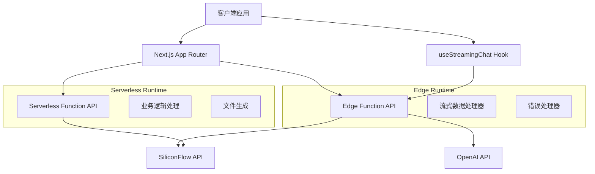

# 流式响应功能设计文档 (MVP版本)

## 概述

本设计文档描述了流式响应功能的MVP实现方案。专注于核心功能：Edge Function流式API、React Hook状态管理、完整聊天界面，确保与现有系统的兼容性。

## 架构设计

### 整体架构



### 混合架构策略

#### Edge Function 使用场景
- **实时聊天对话** (`/api/chat-stream`)
- **快速响应查询** 
- **流式内容生成**
- **低延迟交互**

#### Serverless Function 使用场景
- **完整方案生成** (`/api/generate-plan`)
- **文件处理** (`/api/generate-pdf`, `/api/generate-word`)
- **复杂业务逻辑**
- **数据库操作**

## 组件和接口设计

### 1. Edge Function API (`app/api/chat-stream/route.ts`)

```typescript
interface ChatStreamAPI {
  // 请求接口
  POST: (request: ChatRequest) => Promise<StreamResponse>
  
  // 配置
  runtime: 'edge'
  
  // 核心功能
  - 模型配置复用 (lib/models.ts)
  - 多API提供商支持 (SiliconFlow + OpenAI)
  - 流式数据处理
  - 错误处理和日志记录
}

interface ChatRequest {
  messages: ChatMessage[]
  modelId?: string
  temperature?: number
  max_tokens?: number
}

interface StreamResponse {
  // Server-Sent Events 格式
  headers: {
    'Content-Type': 'text/event-stream'
    'Cache-Control': 'no-cache'
    'Connection': 'keep-alive'
  }
  body: ReadableStream<Uint8Array>
}
```

### 2. 类型系统 (`lib/chat-types.ts`)

```typescript
// 核心消息类型
interface ChatMessage {
  role: 'system' | 'user' | 'assistant'
  content: string
  timestamp: number
}

// 流式响应状态
interface StreamingState {
  messages: ChatMessage[]
  currentResponse: string
  isStreaming: boolean
  error: string | null
}

// Hook 配置选项
interface StreamingChatOptions {
  modelId?: string
  temperature?: number
  max_tokens?: number
  systemMessage?: string
}

// API 响应格式
interface StreamChunk {
  content?: string
  error?: string
  done?: boolean
}
```

### 3. React Hook (`hooks/use-streaming-chat.ts`)

```typescript
interface StreamingChatHook {
  // 状态管理
  state: StreamingState
  
  // 核心方法
  sendMessage: (content: string) => Promise<void>
  stopStreaming: () => void
  clearMessages: () => void
  retryLastMessage: () => void
  
  // 内部功能
  - AbortController 支持
  - 错误处理和重试
  - 状态同步
  - 内存管理
}
```

### 4. UI 组件架构

```typescript
// 基础聊天组件
interface ChatStreamingComponent {
  - 消息列表渲染
  - 实时流式显示
  - 输入处理
  - 基础控制功能
}

// 增强聊天组件
interface EnhancedChatComponent extends ChatStreamingComponent {
  - 模型选择器
  - 高级配置选项
  - 详细状态显示
  - 完整错误处理
}
```

## 数据模型

### 消息流数据结构

```typescript
// 输入消息
{
  role: 'user',
  content: '用户输入的问题',
  timestamp: 1642694400000
}

// 流式响应块
{
  content: '部分AI回复内容',
  timestamp: 1642694401000
}

// 完整响应消息
{
  role: 'assistant',
  content: '完整的AI回复内容',
  timestamp: 1642694405000
}
```

### API 提供商抽象

```typescript
interface StreamProvider {
  endpoint: string
  getHeaders: (apiKey: string) => Record<string, string>
  formatRequest: (request: ChatRequest) => any
  parseStreamChunk: (chunk: string) => string | null
}

// SiliconFlow 实现
class SiliconFlowProvider implements StreamProvider {
  endpoint = 'https://api.siliconflow.cn/v1/chat/completions'
  // ... 具体实现
}

// OpenAI 实现
class OpenAIProvider implements StreamProvider {
  endpoint = 'https://api.openai.com/v1/chat/completions'
  // ... 具体实现
}
```

## 错误处理策略

### 1. 分层错误处理

```typescript
// API 层错误
- 网络连接错误
- API 认证失败
- 速率限制
- 服务不可用

// 流处理错误
- 数据解析失败
- 连接中断
- 超时处理

// 客户端错误
- 状态同步错误
- 内存泄漏防护
- UI 渲染错误
```

### 2. 错误恢复机制

```typescript
interface ErrorRecovery {
  // 自动重试
  retryWithBackoff: (maxRetries: number) => Promise<void>
  
  // 降级处理
  fallbackToAlternativeProvider: () => Promise<void>
  
  // 用户控制
  manualRetry: () => void
  clearErrorState: () => void
}
```

## 性能优化设计

### 1. Edge Function 优化

```typescript
// 冷启动优化
- 最小化依赖包大小
- 使用 Edge Runtime 原生 API
- 避免复杂的初始化逻辑

// 运行时优化
- 流式数据处理
- 内存使用控制
- 连接池管理
```

### 2. 客户端优化

```typescript
// React 性能优化
- useCallback 和 useMemo 优化
- 虚拟滚动（长对话场景）
- 防抖输入处理

// 网络优化
- 请求去重
- 连接复用
- 智能重连
```

## 测试策略

### 1. 单元测试

```typescript
// API 测试
- Edge Function 路由测试
- 流式数据处理测试
- 错误处理测试

// Hook 测试
- 状态管理测试
- 异步操作测试
- 错误场景测试

// 组件测试
- 渲染测试
- 交互测试
- 状态变化测试
```

### 2. 集成测试

```typescript
// 端到端流程测试
- 完整对话流程
- 模型切换测试
- 错误恢复测试

// 性能测试
- 响应时间测试
- 并发用户测试
- 内存使用测试
```

## 部署和监控

### 1. Vercel 部署配置

```json
{
  "functions": {
    "app/api/chat-stream/route.ts": {
      "runtime": "edge",
      "regions": ["hkg1", "sin1"]
    },
    "app/api/generate-plan/route.ts": {
      "runtime": "nodejs18.x",
      "maxDuration": 60
    }
  }
}
```

### 2. 环境变量管理

```bash
# 共享配置
SILICONFLOW_API_KEY=sk-xxx
OPENAI_API_KEY=sk-xxx

# Edge Function 专用
NEXT_PUBLIC_EDGE_REGION=hkg1

# Serverless Function 专用
DATABASE_URL=postgresql://xxx
```

### 3. 监控和日志

```typescript
// 结构化日志
interface LogEntry {
  requestId: string
  timestamp: string
  level: 'info' | 'warn' | 'error'
  message: string
  metadata: Record<string, any>
}

// 性能指标
interface PerformanceMetrics {
  responseTime: number
  throughput: number
  errorRate: number
  concurrentUsers: number
}
```

## 安全考虑

### 1. API 安全

```typescript
// 认证和授权
- API 密钥管理
- 请求频率限制
- 输入验证和清理

// 数据保护
- 敏感信息过滤
- 传输加密
- 日志脱敏
```

### 2. 客户端安全

```typescript
// XSS 防护
- 内容转义
- CSP 策略
- 安全的 HTML 渲染

// 数据泄露防护
- 本地存储加密
- 会话管理
- 敏感数据清理
```

## 扩展性设计

### 1. 模块化架构

```typescript
// 可插拔的 AI 提供商
interface AIProvider {
  name: string
  endpoint: string
  authenticate: (apiKey: string) => boolean
  createStream: (request: ChatRequest) => ReadableStream
}

// 可配置的 UI 主题
interface ChatTheme {
  colors: ColorScheme
  typography: TypographyConfig
  layout: LayoutConfig
}
```

### 2. 功能扩展点

```typescript
// 中间件支持
interface StreamMiddleware {
  beforeRequest: (request: ChatRequest) => ChatRequest
  afterResponse: (response: string) => string
  onError: (error: Error) => void
}

// 插件系统
interface ChatPlugin {
  name: string
  version: string
  install: (context: ChatContext) => void
  uninstall: () => void
}
```

## 迁移和兼容性

### 1. 现有系统集成

```typescript
// 复用现有配置
- lib/models.ts 模型配置
- 环境变量管理
- 错误处理模式

// 保持 API 兼容性
- 相同的认证机制
- 一致的响应格式
- 统一的错误码
```

### 2. 渐进式升级

```typescript
// 功能开关
interface FeatureFlags {
  enableStreamingChat: boolean
  enableModelSelection: boolean
  enableAdvancedUI: boolean
}

// 版本兼容
interface APIVersion {
  version: string
  supportedFeatures: string[]
  deprecatedFeatures: string[]
}
```