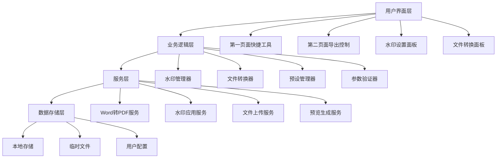

# Word转PDF与水印功能设计文档

## 概述

本设计文档基于需求文档，提供Word转PDF与水印功能的完整技术设计方案。系统将在现有架构基础上扩展，添加文件转换、水印管理和导出控制功能。

## 架构设计

### 系统架构图



### 模块划分

#### 1. 前端UI模块
- **QuickToolsBar**: 第一页面快捷工具栏
- **FileConverterModal**: Word转PDF弹窗
- **WatermarkSettingsModal**: 水印设置弹窗
- **ExportActionsEnhanced**: 增强的导出组件
- **WatermarkPreview**: 水印预览组件

#### 2. 水印管理模块
- **WatermarkConfigManager**: 水印配置管理
- **WatermarkPresetManager**: 预设管理
- **WatermarkValidator**: 参数验证
- **WatermarkRenderer**: 水印渲染

#### 3. 文件处理模块
- **FileUploadHandler**: 文件上传处理
- **WordToPdfConverter**: Word转PDF转换
- **FileValidator**: 文件验证
- **TempFileManager**: 临时文件管理

#### 4. 数据持久化模块
- **LocalStorageManager**: 本地存储管理
- **ConfigSyncManager**: 跨页面配置同步
- **PresetStorageManager**: 预设存储管理

## 组件和接口设计

### 核心接口定义

#### 水印配置接口
```typescript
interface WatermarkConfig {
  version: string
  timestamp: string
  type: 'text' | 'image' | 'text+image'
  textConfig?: {
    content: string
    font: string
    fontSize: number
    color: string
    opacity: number
    rotation: number
    bold: boolean
    italic: boolean
  }
  imageConfig?: {
    enabled: boolean
    filename: string
    width: number
    height: number
    opacity: number
    position: 'center' | 'top-left' | 'top-right' | 'bottom-left' | 'bottom-right'
    fileHash: string
  }
  layoutConfig: {
    pattern: 'diagonal' | 'grid' | 'single'
    spacing: number
    offset: { x: number; y: number }
  }
}
```

#### 预设管理接口
```typescript
interface WatermarkPreset {
  id: string
  name: string
  description: string
  config: WatermarkConfig
  tags: string[]
  usage: {
    count: number
    lastUsed: string
  }
  metadata: {
    createdAt: string
    updatedAt: string
    createdBy: string
  }
}
```

#### 文件转换接口
```typescript
interface ConversionRequest {
  file: File
  options: {
    includeWatermark: boolean
    watermarkConfig?: WatermarkConfig
    outputFormat: 'pdf'
  }
}

interface ConversionResponse {
  success: boolean
  fileUrl?: string
  error?: string
  metadata: {
    originalSize: number
    convertedSize: number
    duration: number
  }
}
```

### API端点设计

#### 文件转换API
```typescript
// POST /api/convert-file
interface ConvertFileRequest {
  file: FormData
  watermarkConfig?: WatermarkConfig
  includeWatermark: boolean
}

// POST /api/generate-pdf-with-watermark
interface GeneratePDFRequest {
  content: string
  storeName: string
  bannerImage?: string
  watermarkConfig: WatermarkConfig
  includeWatermark: boolean
}
```

#### 水印管理API
```typescript
// GET /api/watermark/presets
// POST /api/watermark/presets
// PUT /api/watermark/presets/:id
// DELETE /api/watermark/presets/:id

// POST /api/watermark/validate
interface ValidateWatermarkRequest {
  config: string // JSON string
}
```

## 数据模型设计

### 本地存储结构

#### 水印配置存储
```typescript
// localStorage key: 'watermark-config'
interface StoredWatermarkConfig {
  current: WatermarkConfig
  presets: WatermarkPreset[]
  settings: {
    autoSave: boolean
    syncAcrossPages: boolean
    defaultPresetId?: string
  }
}
```

#### 用户偏好存储
```typescript
// localStorage key: 'export-preferences'
interface ExportPreferences {
  word: {
    includeBanner: boolean
    defaultFilename: string
  }
  pdf: {
    includeWatermark: boolean
    defaultWatermarkPreset?: string
    quality: 'high' | 'medium' | 'low'
  }
}
```

### 参数复制粘贴格式

#### JSON参数结构
```json
{
  "version": "1.0",
  "timestamp": "2025-01-23T10:30:00Z",
  "signature": "watermark-config-v1",
  "watermarkConfig": {
    "type": "text+image",
    "textConfig": {
      "content": "星光传媒生成",
      "font": "Source Han Sans SC",
      "fontSize": 36,
      "color": "#E5E7EB",
      "opacity": 0.3,
      "rotation": -45,
      "bold": false,
      "italic": false
    },
    "imageConfig": {
      "enabled": true,
      "filename": "logo.png",
      "width": 200,
      "height": 100,
      "opacity": 0.7,
      "position": "center",
      "fileHash": "sha256:abc123..."
    },
    "layoutConfig": {
      "pattern": "diagonal",
      "spacing": 200,
      "offset": { "x": 0, "y": 0 }
    }
  },
  "metadata": {
    "createdBy": "watermark-system",
    "description": "默认品牌水印配置",
    "tags": ["brand", "default"]
  }
}
```

## 错误处理策略

### 文件处理错误
1. **文件格式错误**: 提供支持格式列表和转换建议
2. **文件大小超限**: 显示当前大小和限制，建议压缩方法
3. **转换失败**: 提供LibreOffice安装指导和备选方案
4. **网络错误**: 自动重试机制和离线提示

### 水印配置错误
1. **参数格式错误**: 详细的JSON格式验证和修复建议
2. **版本不兼容**: 提供版本升级路径和兼容性说明
3. **图片文件缺失**: 提示重新上传和文件要求
4. **预览生成失败**: 降级到文本描述和重试选项

### 存储和同步错误
1. **本地存储满**: 提供清理建议和重要数据备份
2. **跨页面同步失败**: 手动刷新和数据恢复选项
3. **预设损坏**: 自动修复和备份恢复机制

## 测试策略

### 单元测试
- **水印配置验证**: 测试各种参数组合的验证逻辑
- **文件格式检查**: 测试支持和不支持格式的处理
- **JSON参数解析**: 测试复制粘贴功能的解析准确性
- **预设管理**: 测试CRUD操作和数据完整性

### 集成测试
- **文件上传转换**: 端到端的文件处理流程
- **水印应用**: 水印在PDF中的正确显示
- **跨页面同步**: 配置在不同页面间的同步
- **错误恢复**: 各种错误场景的处理

### 用户体验测试
- **响应时间**: 预览更新和文件转换的性能
- **界面交互**: 拖拽上传和快捷键操作
- **错误提示**: 错误信息的清晰度和有用性
- **移动端适配**: 触摸操作和响应式布局

### 兼容性测试
- **浏览器兼容**: Chrome、Firefox、Safari、Edge
- **文件格式**: 不同版本的.docx文件
- **LibreOffice版本**: 不同版本的转换兼容性
- **设备性能**: 低配置设备的处理能力

## 性能优化

### 前端优化
- **懒加载**: 水印预览和文件转换组件按需加载
- **防抖处理**: 水印参数调整的实时预览优化
- **缓存策略**: 预设和配置的本地缓存
- **文件压缩**: 上传前的文件大小优化

### 后端优化
- **并发处理**: 支持多个文件同时转换
- **资源管理**: 临时文件的及时清理
- **缓存机制**: 常用水印配置的服务端缓存
- **负载均衡**: LibreOffice进程的负载分配

### 存储优化
- **数据压缩**: 预设和配置的压缩存储
- **清理策略**: 过期数据的自动清理
- **备份机制**: 重要配置的自动备份
- **同步优化**: 跨页面数据同步的性能优化