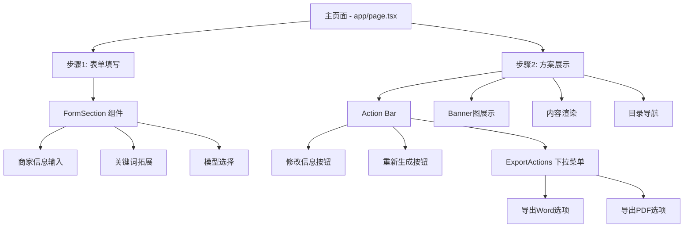
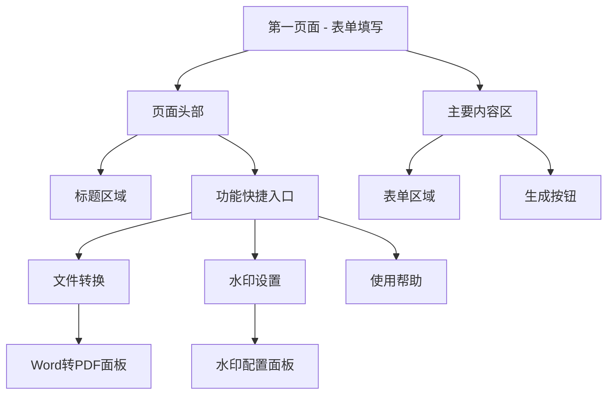
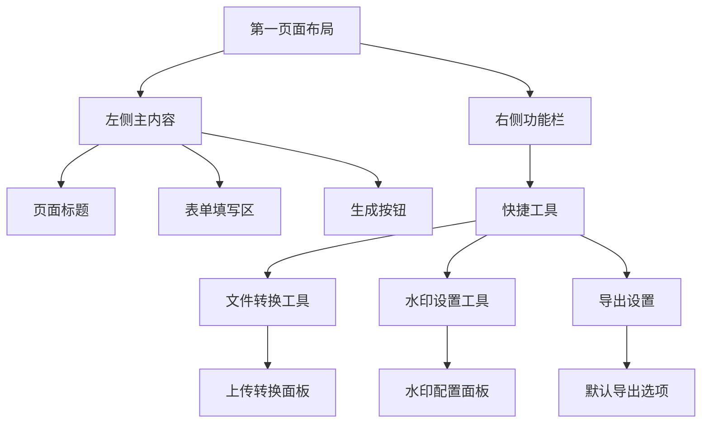
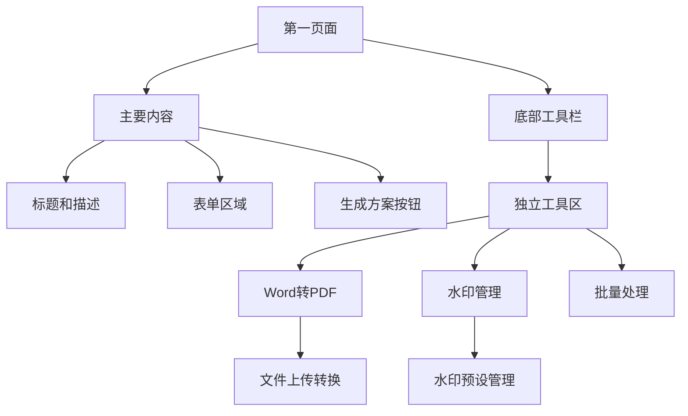
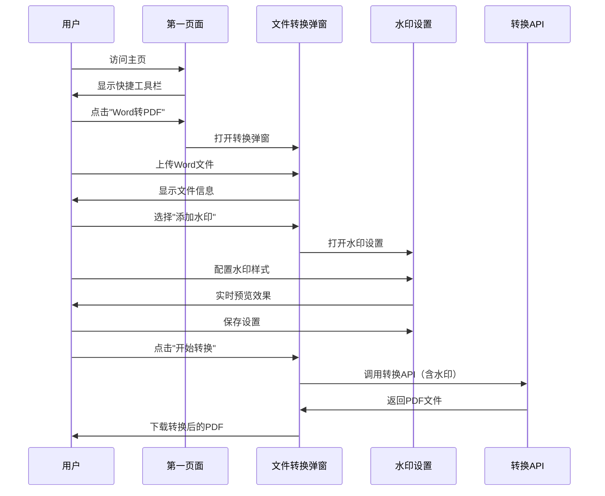
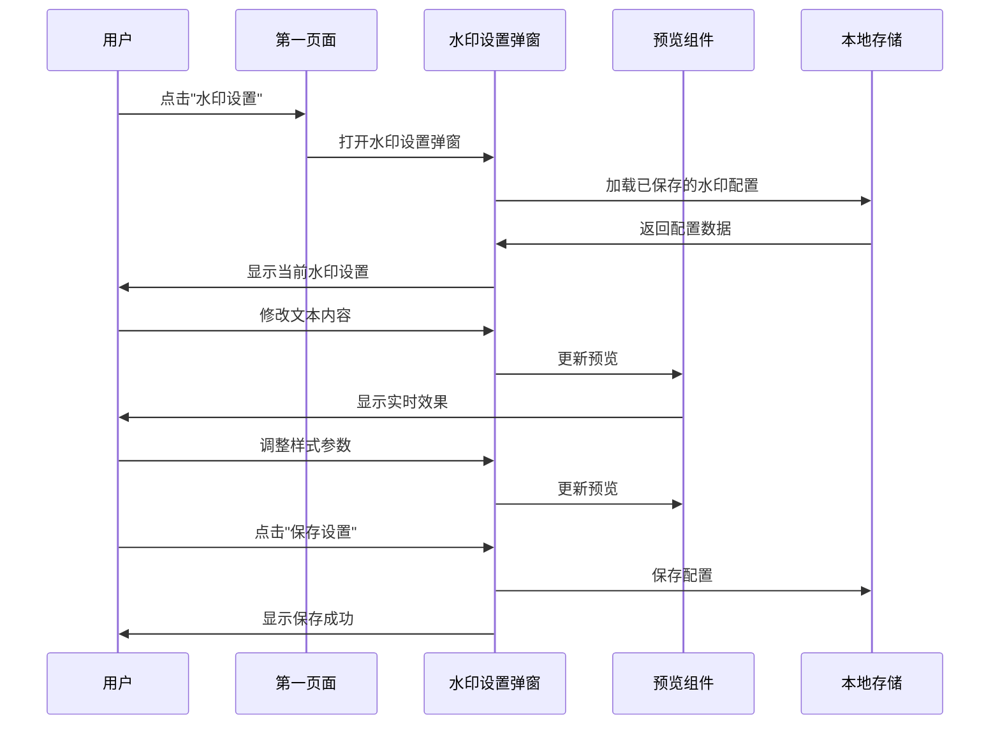
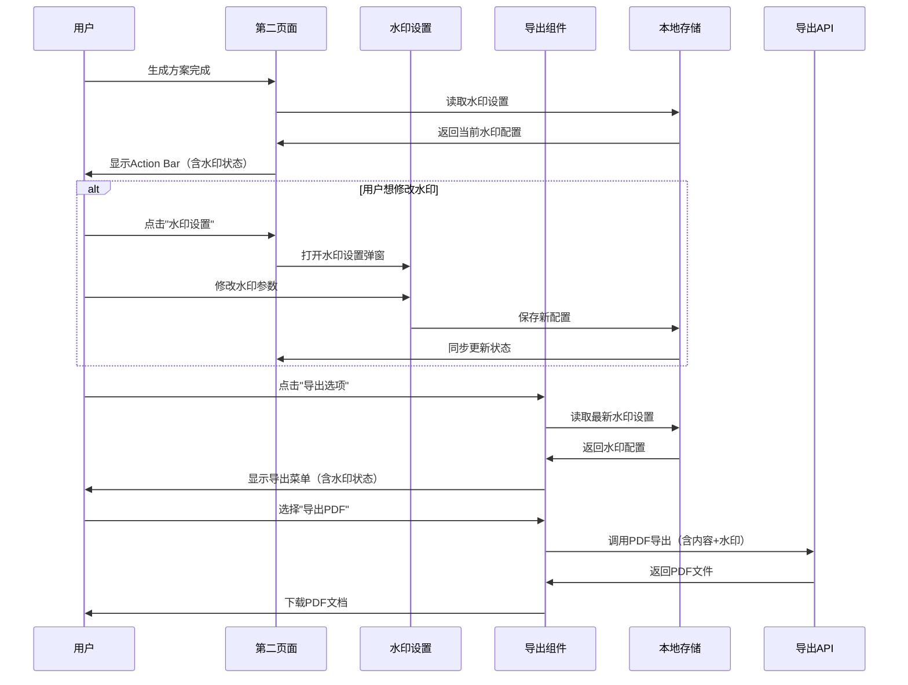
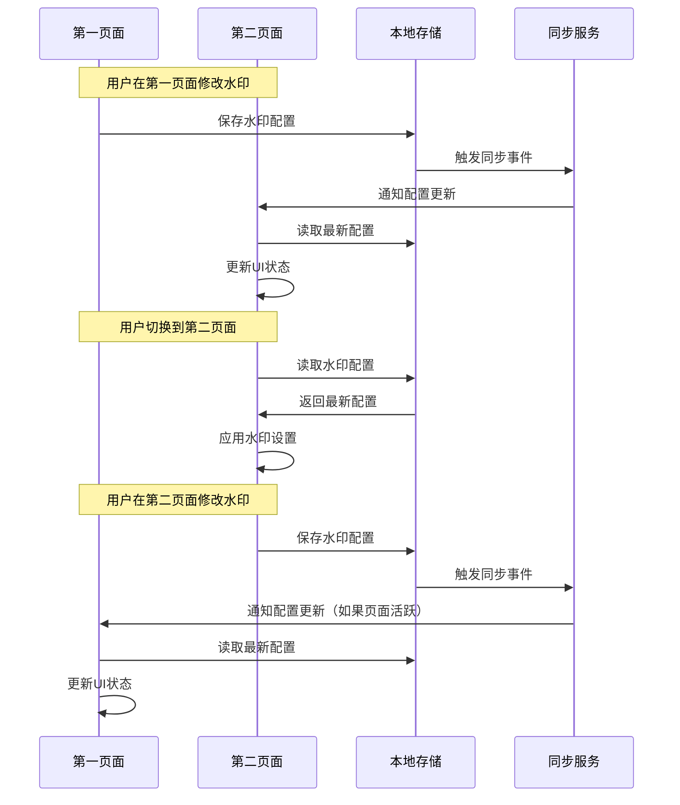

# UI原型设计 - Word转PDF与水印功能

## 当前UI结构分析

基于现有代码分析，当前的UI结构如下：



## 新功能入口设计方案

### 方案1：第一页面顶部功能区（推荐）



### 方案2：第一页面侧边功能栏



### 方案3：第一页面底部工具栏



## 详细UI设计

### 第一页面新增功能区域设计

#### 方案1：页面顶部功能区（推荐）

```
┌─────────────────────────────────────────────────────────────┐
│ 老板IP打造方案生成器                                        │
│ 填写您的店铺信息，系统将为您量身定制专业的IP打造方案          │
├─────────────────────────────────────────────────────────────┤
│ 快捷工具: [📄 Word转PDF] [🎨 水印设置] [❓ 使用帮助]        │
└─────────────────────────────────────────────────────────────┘

┌─────────────────────────────────────────────────────────────┐
│ 商家信息填写                                                │
│ 请填写以下信息，我们将为您生成专业的老板IP打造方案            │
├─────────────────────────────────────────────────────────────┤
│ [表单内容区域]                                              │
│                                                             │
│ [生成专业方案] 按钮                                         │
└─────────────────────────────────────────────────────────────┘
```

#### 方案2：右侧功能面板

```
┌─────────────────────────────────┬───────────────────────────┐
│ 老板IP打造方案生成器             │ 快捷工具                  │
│                                 ├───────────────────────────┤
│ ┌─────────────────────────────┐ │ 📄 Word转PDF              │
│ │ 商家信息填写                 │ │ ┌─────────────────────┐   │
│ │                             │ │ │ 上传Word文件         │   │
│ │ [表单字段]                  │ │ │ 转换为PDF           │   │
│ │                             │ │ └─────────────────────┘   │
│ │                             │ │                           │
│ │                             │ │ 🎨 水印设置               │
│ │                             │ │ ┌─────────────────────┐   │
│ │                             │ │ │ 文本: 星光传媒      │   │
│ │                             │ │ │ 透明度: 30%         │   │
│ │ [生成专业方案]              │ │ │ [预览] [保存]       │   │
│ └─────────────────────────────┘ │ └─────────────────────┘   │
└─────────────────────────────────┴───────────────────────────┘
```

### Word转PDF功能面板设计

#### Word转PDF弹窗面板

```
┌─────────────────────────────────────────┐
│ Word转PDF转换工具                       │
├─────────────────────────────────────────┤
│ 📁 文件上传                             │
│ ┌─────────────────────────────────────┐ │
│ │ 📄 拖拽Word文件到此处或点击选择      │ │
│ │    支持.docx格式，最大10MB          │ │
│ │    ┌─────────────────────────────┐   │ │
│ │    │ [选择文件]                  │   │ │
│ │    └─────────────────────────────┘   │ │
│ └─────────────────────────────────────┘ │
│                                         │
│ ⚙️ 转换选项                             │
│ ☑ 添加PDF水印                          │
│ [🎨 水印设置] [👁 预览效果]              │
│                                         │
│ 📊 转换历史                             │
│ • document1.docx → document1.pdf ✅     │
│ • report.docx → report.pdf ✅           │
│                                         │
│ [开始转换] [取消]                       │
└─────────────────────────────────────────┘
```

#### 水印设置弹窗面板（增强版）

```
┌─────────────────────────────────────────┐
│ PDF水印设置                             │
├─────────────────────────────────────────┤
│ 💾 水印预设管理                         │
│ 当前预设: [默认水印 ▼] [💾 另存为] [🗑️]  │
│ ┌─────────────────────────────────────┐ │
│ │ � 我的预 设:                        │ │
│ │ • 默认水印 (星光传媒 AI 生成)       │ │
│ │ • 品牌水印 (公司LOGO + 文字)        │ │
│ │ • 机密文档 (红色CONFIDENTIAL)       │ │
│ │ • 草稿水印 (灰色DRAFT)              │ │
│ │ [+ 新建预设]                        │ │
│ └─────────────────────────────────────┘ │
├─────────────────────────────────────────┤
│ 🎨 水印类型                             │
│ ○ 仅文本  ○ 仅图片  ● 文本+图片        │
│                                         │
│ � 文本水览印                             │
│ 内容: [星光传媒 AI 生成        ]        │
│ 字体: [思源黑体 ▼] 大小: [36px]         │
│ 颜色: [🎨] 透明度: [━━━━━○━━━━] 30%      │
│ 角度: [━━━○━━━━━━] -45°                  │
│                                         │
│ 🖼️ 图片水印                             │
│ [选择图片] [logo.png] [删除]            │
│ 透明度: [━━━━━━○━━━] 70%                 │
│ 位置: [居中 ▼] 大小: [200x100px]        │
│                                         │
│ � 实时预览                              │
│ ┌─────────────────────────────────────┐ │
│ │ ┌─────────────────────────────────┐ │ │
│ │ │        PDF文档预览              │ │ │
│ │ │                                 │ │ │
│ │ │    星光传媒 AI 生成             │ │ │
│ │ │         [LOGO]                  │ │ │
│ │ │                                 │ │ │
│ │ └─────────────────────────────────┘ │ │
│ └─────────────────────────────────────┘ │
│                                         │
│ [应用到当前] [💾 保存预设] [取消]        │
└─────────────────────────────────────────┘
```

#### 新建/编辑预设弹窗

```
┌─────────────────────────────────────────┐
│ 保存水印预设                            │
├─────────────────────────────────────────┤
│ 📝 预设信息                             │
│ 预设名称: [品牌水印v2        ]          │
│ 描述: [公司品牌标准水印，适用于对外文档] │
│                                         │
│ 🏷️ 标签分类                             │
│ ☑ 品牌相关  ☐ 机密文档  ☐ 草稿文档     │
│ ☐ 个人使用  ☐ 客户专用                 │
│                                         │
│ 📊 当前配置预览                         │
│ • 类型: 文本+图片                       │
│ • 文本: "星光传媒 AI 生成"              │
│ • 字体: 思源黑体, 36px, 30%透明度       │
│ • 图片: logo.png, 居中, 70%透明度       │
│                                         │
│ � 配用置代码 (可复制分享)                │
│ ┌─────────────────────────────────────┐ │
│ │ WM_TEXT:星光传媒 AI 生成;FONT:思源黑体│ │
│ │ ;SIZE:36;COLOR:#E5E7EB;OPACITY:30;  │ │
│ │ ANGLE:-45;IMG:logo.png;IMG_OP:70    │ │
│ │ [📋 复制代码] [📥 导入代码]          │ │
│ └─────────────────────────────────────┘ │
│                                         │
│ 🔄 使用频率                             │
│ ○ 偶尔使用  ● 经常使用  ○ 默认预设     │
│                                         │
│ [保存预设] [取消]                       │
└─────────────────────────────────────────┘
```

#### 水印配置导入弹窗

```
┌─────────────────────────────────────────┐
│ 导入水印配置                            │
├─────────────────────────────────────────┤
│ 📥 导入方式                             │
│ ○ 粘贴配置代码  ● 上传配置文件          │
│                                         │
│ 📋 配置代码输入                         │
│ ┌─────────────────────────────────────┐ │
│ │ WM_TEXT:星光传媒 AI 生成;FONT:思源黑体│ │
│ │ ;SIZE:36;COLOR:#E5E7EB;OPACITY:30;  │ │
│ │ ANGLE:-45;IMG:logo.png;IMG_OP:70    │ │
│ └─────────────────────────────────────┘ │
│ [📋 从剪贴板粘贴]                       │
│                                         │
│ 📁 或选择配置文件                       │
│ [选择.json文件] [watermark-config.json] │
│                                         │
│ 👁 预览导入效果                         │
│ ┌─────────────────────────────────────┐ │
│ │ ✅ 配置有效                         │ │
│ │ • 文本水印: 星光传媒 AI 生成        │ │
│ │ • 图片水印: logo.png                │ │
│ │ • 预计效果: [预览图]                │ │
│ └─────────────────────────────────────┘ │
│                                         │
│ [导入并应用] [仅预览] [取消]             │
└─────────────────────────────────────────┘
```

#### 预设管理面板

```
┌─────────────────────────────────────────┐
│ 水印预设管理                            │
├─────────────────────────────────────────┤
│ 🔍 搜索: [搜索预设...] [🏷️ 全部分类 ▼]  │
│                                         │
│ 📋 预设列表                             │
│ ┌─────────────────────────────────────┐ │
│ │ ⭐ 默认水印                         │ │
│ │    星光传媒 AI 生成 | 使用432次     │ │
│ │    [预览] [编辑] [复制] [删除]      │ │
│ ├─────────────────────────────────────┤ │
│ │ 🏢 品牌水印                         │ │
│ │    公司LOGO + 文字 | 使用156次      │ │
│ │    [预览] [编辑] [复制] [删除]      │ │
│ ├─────────────────────────────────────┤ │
│ │ 🔒 机密文档                         │ │
│ │    红色CONFIDENTIAL | 使用23次      │ │
│ │    [预览] [编辑] [复制] [删除]      │ │
│ ├─────────────────────────────────────┤ │
│ │ 📝 草稿水印                         │ │
│ │    灰色DRAFT | 使用67次             │ │
│ │    [预览] [编辑] [复制] [删除]      │ │
│ └─────────────────────────────────────┘ │
│                                         │
│ 📤 导入/导出                            │
│ [导入预设文件] [导出全部预设]           │
│                                         │
│ [+ 新建预设] [批量管理] [关闭]          │
└─────────────────────────────────────────┘
```

#### 第二页面导出选项增强

```
┌─────────────────────────────────────────────────────────────┐
│ Action Bar - 第二页面                                       │
├─────────────────────────────────────────────────────────────┤
│ [修改信息] [重新生成] [🎨 水印设置] [导出选项 ▼]             │
└─────────────────────────────────────────────────────────────┘

导出选项下拉菜单：
┌─────────────────────────────────────────┐
│ 📄 导出为 Word                          │
│    ☑ 包含Banner图                       │
│    ☐ 包含水印 (Word不支持)              │
│    专业格式，可编辑                      │
├─────────────────────────────────────────┤
│ 📋 导出为 PDF                           │
│    ☐ 包含Banner图                       │
│    ☑ 包含水印  [当前: 默认水印]         │
│    固定格式，便于分享                    │
├─────────────────────────────────────────┤
│ 🔧 批量处理                             │
│    同时生成Word和PDF                    │
│    [高级选项]                           │
└─────────────────────────────────────────┘

第二页面水印设置按钮功能：
- 点击后打开与第一页面相同的水印设置弹窗
- 显示当前使用的水印预设名称
- 修改后立即同步到第一页面
- 支持快速切换预设
```

#### 跨页面水印状态同步

```
┌─────────────────────────────────────────┐
│ 水印状态指示器 (两个页面都有)            │
├─────────────────────────────────────────┤
│ 当前水印: [默认水印 ▼] [🎨 编辑]        │
│                                         │
│ 快速预设切换:                           │
│ [默认] [品牌] [机密] [草稿] [+ 更多]     │
│                                         │
│ 状态: ✅ 已启用 | 最后修改: 2分钟前      │
└─────────────────────────────────────────┘
```

#### 第一页面增强的快捷工具栏

```
┌─────────────────────────────────────────────────────────────┐
│ 老板IP打造方案生成器                                        │
│ 填写您的店铺信息，系统将为您量身定制专业的IP打造方案          │
├─────────────────────────────────────────────────────────────┤
│ 快捷工具: [📄 Word转PDF] [🎨 水印设置] [❓ 使用帮助]        │
│                                                             │
│ 当前水印: [默认水印 ▼] ✅ 已启用                            │
└─────────────────────────────────────────────────────────────┘
```

## 推荐实现方案

### 第一页面功能入口方案（推荐）

#### 优势分析
1. **即时可用**：用户无需生成方案即可使用工具功能
2. **功能独立**：Word转PDF和水印设置作为独立工具存在
3. **用户友好**：在主要工作流程之外提供便捷工具
4. **降低门槛**：不强制用户填写表单就能使用转换功能

#### 具体实现建议

##### 1. 第一页面布局调整
- 在页面标题下方添加"快捷工具"区域
- 使用卡片或按钮组展示工具入口
- 保持原有表单区域不变

##### 2. 新增组件结构
```
components/
├── quick-tools-bar.tsx (新增 - 第一页面工具栏)
├── file-converter-modal.tsx (新增 - Word转PDF弹窗)
├── watermark-settings-modal.tsx (新增 - 水印设置弹窗)
├── export-actions.tsx (扩展 - 第二页面导出)
└── ui/
    ├── watermark-preview.tsx (新增)
    ├── file-upload-zone.tsx (新增)
    └── conversion-history.tsx (新增)
```

##### 3. 页面功能分布

**第一页面（表单页）：**
- 快捷工具：Word转PDF、水印设置
- 独立功能，不依赖表单数据
- 弹窗形式展示详细功能

**第二页面（结果页）：**
- 导出选项：基于生成内容的导出
- 集成水印设置（使用第一页面的配置）
- 支持Banner图控制

## 用户交互流程

### 第一页面 - Word转PDF流程


### 第一页面 - 水印设置流程


### 第二页面 - 增强导出流程


### 跨页面水印同步流程


## 技术实现要点

### 状态管理
- 水印配置使用localStorage持久化存储
- 两个页面都能读取和修改水印配置
- 支持多套水印预设的管理和快速切换
- 配置变更时触发跨页面同步

### 组件通信
- 使用localStorage + 事件监听实现跨页面同步
- 使用Context在单页面内共享水印状态
- 实时预览组件响应配置变化
- 支持多标签页间的配置同步

### 同步机制
- localStorage存储：持久化水印配置和预设
- 事件监听：监听storage事件实现跨页面同步
- 状态管理：使用React Context管理当前页面状态
- 实时更新：配置变更时立即更新UI显示

### 文件处理
- Word转PDF功能复用现有API
- 支持拖拽上传和点击选择
- 显示转换进度和历史记录

这个基于第一页面入口的设计方案如何？符合你的预期吗？